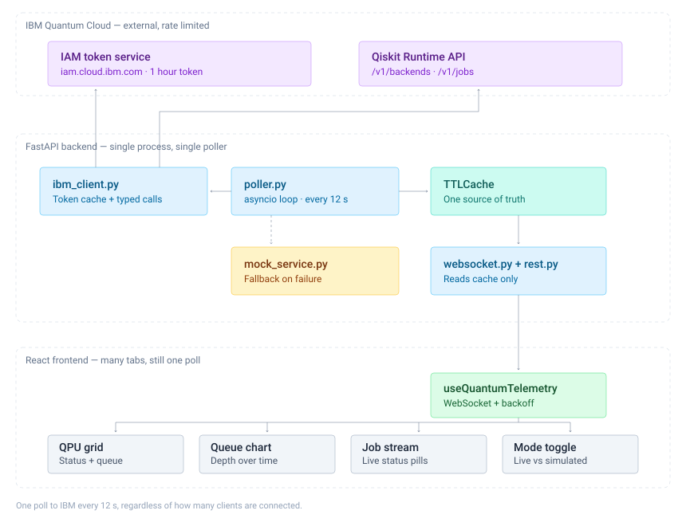

# Architecture & design rationale



This document explains *why* the system is shaped the way it is. The decisions
below were the ones with real alternatives; each records what was rejected and
what the rejection cost or saved.

---

## 1. One poller, not one fetch per client

**Decision.** A single `asyncio` task polls IBM every 12 seconds and writes into
an in-process cache. Every WebSocket client and every REST call reads that cache.
Nothing else in the system talks to IBM.

**The alternative.** Have each connected browser fetch from IBM directly, or have
the WebSocket handler fetch per client on each tick.

**Why it was rejected.** IBM's Runtime API is rate-limited per user. Under the
per-client design, request rate scales with viewers: one analyst with four tabs
open produces four times the traffic, and a demo to a room of people would get
the account throttled within seconds. Under the single-poller design, request
rate is a **constant** — one call per interval, forever, whether nobody or a
hundred people are watching.

The floor is enforced in code rather than documentation, because this is the
easiest way to break the project by accident:

```python
if value < 10.0:
    raise ValueError(f"poll_interval_seconds={value} violates the IBM rate-limit floor …")
```

**Cost.** All clients see the same snapshot, and a client connecting mid-interval
waits up to 12 seconds for its next update. Both are acceptable: telemetry that
is 12 seconds stale is still telemetry, and the initial paint is served from
cache instantly rather than waiting for the next tick.

---

## 2. The poll coroutine does not raise

**Decision.** `TelemetryPoller.poll_once()` catches every exception class IBM can
produce — expired token, DNS failure, timeout, 429, 503, and the unforeseen —
converts it to simulated telemetry, and stamps `source: "mock"` with a
human-readable `degraded_reason`.

**Why.** A dashboard has exactly two failure modes visible to a user: an error
screen, or a blank page. Both are worse than slightly synthetic data clearly
labelled as synthetic. Because the live path and the mock path emit the *same*
Pydantic types, the frontend cannot tell them apart and needs no special-casing.

This is asserted, not assumed — `test_poller.py` parametrises over every failure
class and requires that the returned snapshot still contains a renderable fleet.

**Consequence.** There is no loading spinner after first paint, no error boundary,
and no retry button anywhere in the UI. The system has no error state to render.

---

## 3. A rejected credential latches; a network blip does not

**Decision.** `IBMAuthError` (a 400/401 from IAM) sets a permanent flag that stops
further live attempts. `IBMQuantumError` (timeout, 503, 429) does not.

**Why.** These failures differ in kind. A timeout is transient and worth retrying
every 12 seconds. A wrong API key is not going to become right; retrying it 300
times an hour generates noise in IAM's logs and ours, and achieves nothing.

Two follow-on details this forced, both found by testing rather than reasoning:

- **The reason must survive.** Early on, the latch was set but the *message* was
  not, so snapshot #2 onward reported `degraded_reason: null`. The UI silently
  switched from "your credentials were rejected" to "no credentials configured" —
  telling the user their key was absent when it had in fact been refused.
- **Backoff must stop when polling stops.** Failure backoff exists to be kind to
  IBM. Once the latch is set we never call IBM again, so continuing to back off
  merely halved the dashboard's refresh rate to spare a service we were no longer
  touching. `_next_delay()` now returns the base interval whenever no live call
  will be attempted.

The snapshot carries `will_retry` so the UI can say *"the poller has stopped
retrying, fix the credential and restart"* instead of promising a recovery that
is not coming.

---

## 4. No Redis, no Postgres, no broker

**Decision.** An in-process `TTLCache` and a single SQLite file.

**Why.** A Redis pub/sub tier solves a problem this project does not have:
sharing state between multiple backend processes. There is one process, by
design — see §1 — so the cache is simply a Python object, and the fanout is a
`set` of WebSocket connections.

Choosing `TTLCache` over a plain attribute is deliberate. It makes staleness a
property of the data structure: if the poller dies, the entry expires, and
`/api/health` reports an empty cache instead of serving an hour-old snapshot as
though it were current.

**When this would change.** If the dashboard needed to serve enough concurrent
clients to require multiple backend processes, the cache would have to move out
of process, and Redis would become the right answer. That threshold is far above
a single operator or a small team.

**Measured.** Five WebSocket clients were held open simultaneously against the
containerised stack and each received the *same* snapshot — one distinct
`generated_at` across all five frames. Under a per-client design that same
scenario would have produced five separate calls to IBM.

---

## 5. SQLite for history — and why persistence exists at all

**Decision.** Queue depth per backend is appended to SQLite each tick, with a
7-day retention window.

**Why, concretely.** Without it, the queue chart is empty for the first minute
after every page load, because the client has to accumulate points from the
stream. Every screenshot, and the first thing any new viewer sees, would be a
blank chart. Roughly forty lines of SQLite means the chart has shape
immediately, and questions like *"which QPU was busiest this week?"* become
answerable.

A second benefit emerged during testing: the simulator can **resume** from the
last persisted depths. Without that, restarting the backend re-randomised the
fleet and the chart showed a visible cliff where stored history met the new
process. Seeding closes the gap — measured max tick-to-tick change fell from
100+ to 10.

History is strictly best-effort. Every method swallows its exceptions after
logging, because a nice-to-have must never be able to take the poller down.

---

## 6. The mode toggle is a readout, not a switch

**Decision.** The Live / Simulated control reflects the backend's `source` field
and is not clickable.

**Why.** A frontend-controlled switch would be able to *lie* about where the data
came from — the one thing this UI must never do. Mode is determined entirely by
server state: whether credentials are configured, and whether IBM is currently
reachable. The control is styled as a segmented toggle because that reads
instantly; its tooltip explains how to actually change modes.

The same principle drives the two distinct banners. Running without credentials
is the documented default, so it gets a calm grey note. Falling back *after* a
live attempt failed is a real degradation, so it gets the amber warning. Showing
an alarming toast to someone who simply has not configured a key would train them
to ignore it — and then they would ignore the one that matters.

---

## 7. Estimated wait is derived, and labelled as such

IBM's documented `/v1/backends` response contains `queue_length` but **no**
wait-time field. Rather than invent one, the wait is computed from queue depth
and a nominal per-job service time, scaled by processor speed and clamped so an
unusual CLOPS value cannot produce an absurd number. The UI labels the column
"est. wait" and the footer states plainly that the figure is derived, not
reported by IBM.

---

## Corrections to the original specification

Four details in the brief did not match the published API. Building to the brief
as written would have produced `404` and `400` responses:

| Brief said | Actually |
|---|---|
| `GET /v1/backends` | `https://quantum.cloud.ibm.com/api/v1/backends` (EU: `eu-de.quantum.cloud.ibm.com`) |
| Two auth headers | Three — `IBM-API-Version` is required and easy to miss |
| `status` is a string | An object: `{"name": "online", "reason": …}` |
| Statuses `QUEUED/RUNNING/DONE/ERROR` | `Queued/Running/Completed/Cancelled/Failed` |

The brief also referenced `wait_time_seconds` on `/v1/backends`, which does not
appear in the documented response — hence §7. `JobStatus.parse` folds the older
spellings as aliases, so both vocabularies are accepted.

**Sources**
- [IBM Quantum Compute Service REST API](https://quantum.cloud.ibm.com/docs/en/api/qiskit-runtime-rest)
- [Backends endpoints](https://quantum.cloud.ibm.com/docs/en/api/qiskit-runtime-rest/tags/backends)
- [Set up to use IBM Quantum Platform with REST API](https://quantum.cloud.ibm.com/docs/en/guides/cloud-setup-rest-api)
